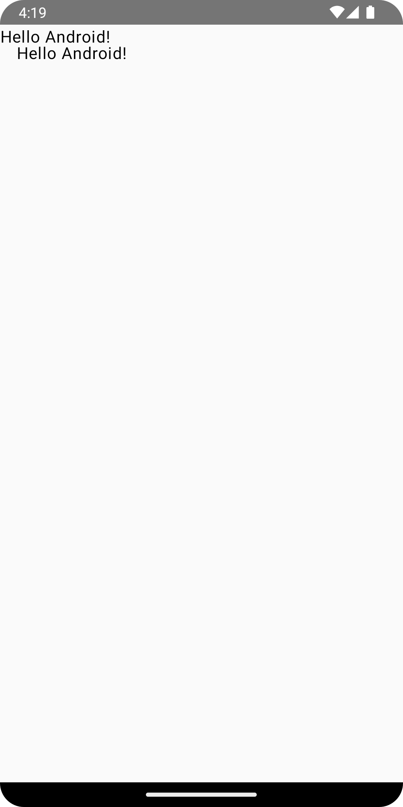

# 1️⃣ 개념 이해
### 💡@Composable
- Jetpack Compose 의 핵심 단위
- UI 를 선언하는 함수에 붙이는 어노테이션
- 예 : @Composable fun Greeting()

### 💡setContent {}
- Activity 에서 Compose UI 를 띄우는 시작 시점
- 기존의 setContentView(R.layout.activity_main) 역할

### 💡@Preview
- Android Studio 에서 Composable 을 미리보기 하기 위한 어노테이션

### ❗️Composable 함수 작성 시 Modifier 를 기본값으로 설정하기
- Modifier 를 기본값으로 설정하면, 해당 Composable 을 사용할 때 Modifier 를 생략할 수 있음
- 그리고 특정 상황에서 Modifier 를 적용해 사용이 가능함 -> 재사용성 증가

### 실행 화면
